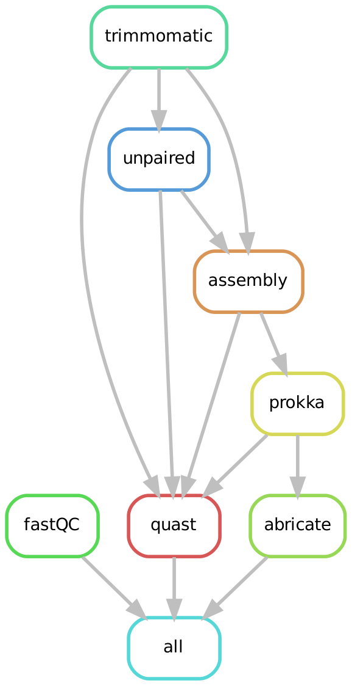
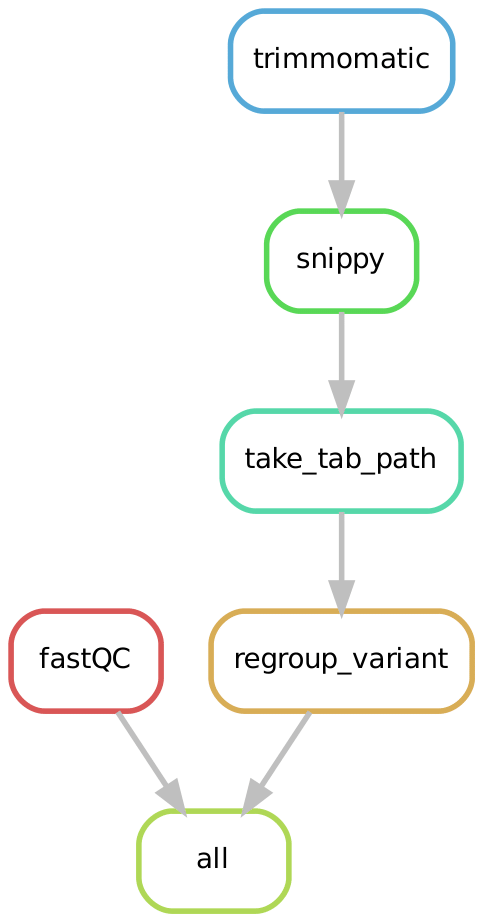

# BAoBAb
Assemble bacterial genome and make variants call.

## Description

This project contains two pipelines handled by Snakemake :
* A de novo bacterial genome assembler coupled with gene annotation.

<p align="center"></p>

* A pipeline for variant calling by comparing against a reference genome. Can be used with a metadata file listing the different bacterial strains used and the experimental conditions (ex : `variant_calling/metadata.csv`).

<p align="center"></p>

## Installation

### Conda

Creating a conda environment using `baobab_env.yml`.

```
conda env create -f baobab_env.yml
```

### Dependencies

Installing all the dependencies manually:

Soft|Version
---------|------------
[Abricate](https://github.com/tseemann/abricate) | 1.0.1
[fastQC](https://www.bioinformatics.babraham.ac.uk/projects/fastqc/) | 0.11.9
[Prokka](https://github.com/tseemann/prokka) | 1.14.6
[Quast](https://quast.sourceforge.net/) | 5.2.0
[Snippy](https://github.com/tseemann/snippy) | 4.6.0
[Trimmomatic](http://www.usadellab.org/cms/?page=trimmomatic) | 0.39
[Unicycler](https://github.com/rrwick/Unicycler) | 0.4.8
