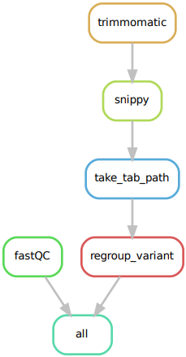

# BAoBAb
Assemble bacterial genome and make variants call.

## Description

This project contains two pipelines handled by Snakemake :
* A de novo bacterial genome assembler coupled with gene annotation design for paired end reads.

<p align="center"></p>

* A pipeline for variant calling by comparing against a reference genome. It's design for paired end reads. Can be used with a metadata file listing the different bacterial strains used and the experimental conditions to regroup output (ex : `variant_calling/metadata.csv`).

<p align="center"></p>

## Installation

### Source

Install the latest version of BAoBAb tools in your directory.

```
git clone https://github.com/BAoBAb-biofilm/BAoBAb.git
```

### Dependencies

Installing all the dependencies manually:

Soft|Version
---------|------------
[AbritAMR](https://github.com/MDU-PHL/abritamr) | 1.0.13
[fastQC](https://www.bioinformatics.babraham.ac.uk/projects/fastqc/) | 0.11.9
[Prokka](https://github.com/tseemann/prokka) | 1.14.6
[Quast](https://quast.sourceforge.net/) | 5.2.0
[Trimmomatic](http://www.usadellab.org/cms/?page=trimmomatic) | 0.39
[Unicycler](https://github.com/rrwick/Unicycler) | 0.5.0
[Snippy](https://github.com/tseemann/snippy) | 4.6.0

## Usage

### Input requirements

To use the two differents tools you need paired end sequence reads files in fastq format (can be in .gz format).
Forward and reverse files must be named like this :
```
strain_name_R1.fastq.gz
strain_name_R2.fastq.gz
```

### De novo assembly

The pipelines are designed for Escherichia coli strains, please change species and genus in prokka and abritamr rules of the genome assembly tool.

```
snakemake -s snakefile_assembly.py
```

### Requirements

* Input : All paired reads need to be located in a `raw_reads` folder.
* The Trimmomatic parameters need to be changed to match the analyses obtained with FastQC.

### Variant calling


```
snakemake -s snakefile_variant_calling.py --configfile config.yaml
```

### Requirements

* Input : All paired reads need to be located in a `raw_reads` folder.
* The Trimmomatic parameters need to be changed to match the analyses obtained with FastQC.
